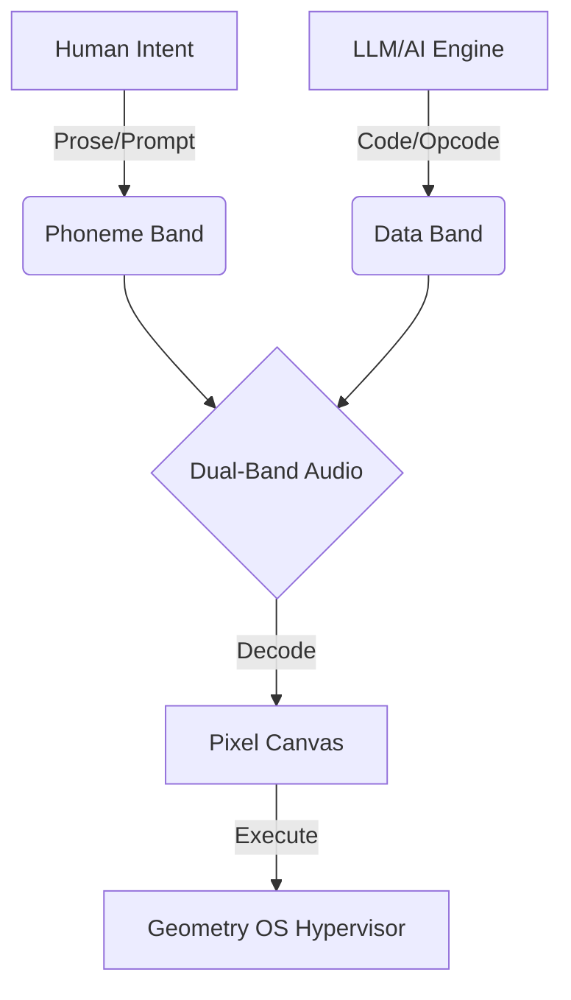

# Visual Audio: System Overview

Visual Audio is a paradigm-shifting subsystem of **Geometry OS** that treats software not as symbolic code on a disk, but as a physical, morphological substance that can exist interchangeably as **text, audio, or pixels**. 

By encoding software into these sensory formats, we bridge the gap between human meaning and machine execution, allowing AI to "speak" software into existence and operating systems to execute images as programs.

---

## 1. Core Philosophy: The Tripartite Substrate

Visual Audio relies on three representations of information that fluidly convert into one another.

1. **Text (Semantic):** Human-legible intent.
2. **Audio (Transmission):** A dual-band acoustic carrier. 
3. **Pixels (Execution):** Dense visual cartridges executed directly by the OS.

---

## 2. The Codecs

The system utilizes three primary codecs to handle the transformation of data.

### A. The Phoneme Codec (Human-Legible Audio)
- **Purpose:** To encode human speech (prompts, instructions, reasoning) into audio.
- **Mechanism:** Uses 39 ARPAbet templates mapped to UPIC-style frequency envelopes (formant-informed). It looks up English words in the CMUdict database, sequences their phonemes, and synthesizes them at 20ms per symbol.
- **Throughput:** ~7.6 words per second.
- **Use Case:** Allowing an LLM to audibly "speak" what it is doing so a human operator understands its intent.

### B. The Spectral/Data Codec (Machine-Readable Audio)
- **Purpose:** To securely transmit raw binary data (software, scripts, binaries) over an acoustic channel.
- **Mechanism:** Uses a 16-tone MFSK (Multiple Frequency-Shift Keying) modulation scheme. Each byte of data is split into two 4-bit nibbles, which are mapped to specific frequencies between 800Hz and 3050Hz.
- **Throughput:** ~24 bytes per second.
- **Use Case:** Transmitting executable payloads over the air or via an audio file.

### C. The Dense Pixel Codec (Spatial Storage)
- **Purpose:** To store the transmitted data as a visual "cartridge" on a 2D canvas.
- **Mechanism:** Takes decoded bytes and packs them densely into 24-bit RGB pixels (3 bytes per pixel). 
- **Throughput:** Instantaneous encoding/decoding.
- **Use Case:** Acting as the "hard drive" for Geometry OS, where the screen is the memory and programs exist as colorful geometric tiles.

---

## 3. The Dual-Band Transmission

The magic of Visual Audio is that **human meaning** and **machine payloads** are transmitted simultaneously in the exact same audio file.

* **Mid-Band (500Hz - 3000Hz):** Contains the synthesized phonetic speech.
* **High-Band (4000Hz - 8000Hz):** Contains the MFSK byte-encoded software.

When an AI writes a program, it outputs a dual-band audio file. A human listening hears the AI explaining what it built. A machine listening filters out the speech, decodes the high-frequency chirp, and extracts a bit-perfect executable.

---

## 4. Execution Pipeline (Geometry OS)

Once the audio is decoded by the system, it doesn't run as standard text.

1. **Extraction:** The machine extracts the payload from the spectral audio band.
2. **Crystallization:** The raw bytes are rendered into a dense pixel cartridge (`.png` tile) and placed onto the infinite 2D canvas of Geometry OS.
3. **Execution:** The `SandboxedExecutor` (or the native Rust GeOS Hypervisor) reads the pixels from the canvas, converts them back to opcodes, and executes them in a secure, resource-limited sandbox.

This entire pipeline operates seamlessly. An LLM speaks an idea, the acoustic waves carry the payload, the waves crystallize into pixels, and the pixels run as software.

---

## 5. Security & Provenance (The "Gate")

Because software is arriving via audio, strict security is enforced:
* **In-band Provenance:** Audio payloads can be cryptographically signed. The receiver verifies the signature before crystallizing the pixels.
* **Sandboxed Cartridges:** The executor enforces strict resource limits (e.g., 5s CPU time, 64MB memory) and blocks dangerous module imports (like `os` or `subprocess`).
* **Visual Verification:** A human can visually inspect the resulting pixel cartridge. Malicious code patterns physically look different than standard opcodes.

---

## 6. Current Roadmap & Next Steps

Currently, the system is fully capable of round-trip execution. The ongoing frontiers include:
* **Error Correction (ECC):** Implementing Reed-Solomon error correction to make acoustic transmission robust against background noise.
* **Geometry OS Integration:** Upgrading the hypervisor to natively ingest audio streams as boot loaders (`audio_boot.rs`).
* **Prosody and Coarticulation:** Making the phoneme speech sound natural and fluid rather than robotic.
